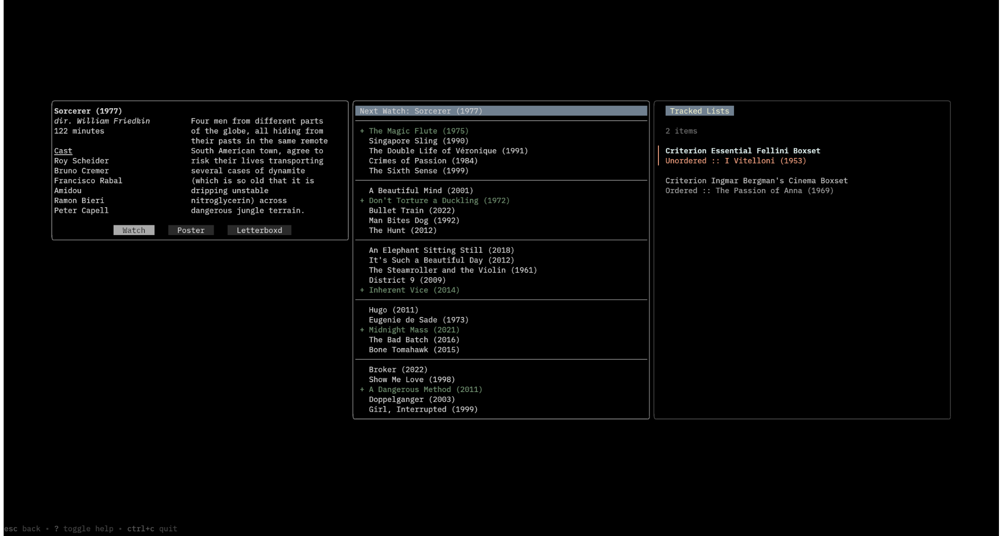

# NW (Next Watch)

A TUI utility for selecting films to watch from
[Letterboxd](https://letterboxd.com/) (powered by
[TMDB](https://www.themoviedb.org/)). Also includes features for quickly
downloading poster images from TMDB and setting your Discord status as the
current film you are watching.



## Main Features

> [!WARNING]
> Some features require a TMDB api key. You can obtain one from [TDMB's
> website](https://developer.themoviedb.org/docs/getting-started) for free.

- Chooses your Next Watch
	- Populates a list of five ordered groups containing five films from your
	  Letterboxd Watchlist, as well as a selection for what film is to be
	  watched next.
	- Each time you watch a film, a film is selected from each group to be
	  promoted to the next group at random.
- Track progress on lists
	- You can search through public lists on your Letterboxd profile, as well
	  as retrieve list from URLs.
	- List can be set as Ordered (suggests the next unwatched film) or
	  Unordered (selects a random unwatched film).
- Search up film details
    - Allows you to quickly search though films via TMDB.
    - Once a film is selected you can 
		- View the film's details
		- Download the poster image
		- Display the film as being "Watched" on Discord.

## Getting Started 

### Installation

There are three ways to install `nw`. If you have [Go](https://go.dev/) installed, `nw` can be installed with

```
go install github.com/jsdoublel/nw@latest
```

Otherwise, you can download a precompiled binary from the [GitHub releases](https://github.com/jsdoublel/nw/releases); or, if you want to build `nw` from source, you can do this by running
```
git clone https://github.com/jsdoublel/nw.git
cd nw
make
```
Running `make` successfully requires that Go is installed.

### Initial setup

When you first start `nw`, it will ask for your Letterboxd username, as well as
your TMDB API Key. If you want to change these values later, they can be set in
the [config file](Configuration). Alternatively, you can launch `nw` with the
`-u` argument to switch Letterboxd accounts (i.e., `nw -u <new username>`).

## Configuration

NW uses a configuration file to adjust various settings. NW will look in a sane
place as per the OS used. You can figure out where this will be by running `nw
-c`, which will print the expected location.

A configuration file with default settings is included in the repository as
`config.toml`. It includes descriptions of the various settings. The file uses
[TOML](https://toml.io/en/) format.
